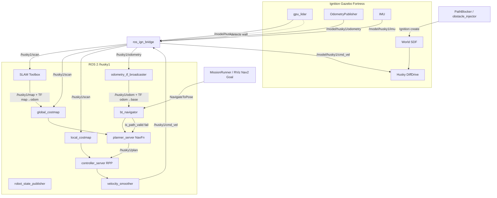

# Simulation Workflow & Implementation Overview

**Package:** `41068_ignition_bringup` (UTS 41068 Robotics Studio 1)  
**ROS 2:** Humble · **Simulator:** Ignition Gazebo Fortress  
**Evidence basis:** repository code + `pathplanning_and_movement_implementation.md` (claims verified against code; where they disagree, **the repository wins**)  
**Workspace assumed in examples:** `~/G25_RS1/RS1-Gr25` (adjust if yours differs)

---

## 1. Purpose

This document is both:

1. A **practical runbook** for building, launching, and demonstrating the Husky simulation (basic sim, autonomous navigation, obstacle insertion, replanning).
2. A **concise implementation map** of how Gazebo, sensors, SLAM, Nav2, RViz, and the demo scripts connect.

It does not invent workflows. Every command, file, node, and topic below exists in this package (or is a standard ROS 2 / Nav2 / Ignition interface that this package configures).

---

## 2. System Overview

The package launches a namespaced Husky (`/husky1`) in Ignition Gazebo, bridges sensors and `cmd_vel`, builds a live map with SLAM Toolbox, and (when enabled) navigates with Nav2.

**Default launch** (`nav2:=false`, `slam:=false`): Gazebo + Husky + bridges + odometry TF — teleop only.  
**Autonomy launch** (`nav2:=true`): also starts SLAM + full Nav2.  
**One-command demo:** `python3 scripts/basic_autonomy_demo.py` starts the stack, sends a goal, optionally injects a wall, and tears everything down.

```text
Ignition Gazebo (DiffDrive + gpu_lidar + IMU + OdometryPublisher)
        ↕ ros_ign_bridge  (/husky1/*)
robot_state_publisher + odometry_tf_broadcaster
        husky1_odom → husky1_base_link
        ↓
SLAM Toolbox (when slam/nav2) → /husky1/map + husky1_map → husky1_odom
        ↓
Nav2 (when nav2:=true)
  costmaps ← lidar + SLAM map
  NavFn (A*) → /husky1/plan
  Regulated Pure Pursuit → velocity_smoother → /husky1/cmd_vel
  bt_navigator ← NavigateToPose
        ↓
MissionRunner / RViz / teleop
```

---

## 3. Prerequisites

| Item | Requirement |
|------|-------------|
| OS | Ubuntu (WSL2 supported; software GL is slower) |
| ROS | ROS 2 Humble |
| Simulator | Ignition Gazebo Fortress (`ignition-fortress`) |
| Workspace | Colcon workspace containing this package under `src/` (e.g. `~/G25_RS1/RS1-Gr25`) |
| Network | `export ROS_LOCALHOST_ONLY=1` recommended in classroom Wi-Fi |

**Apt packages** (from `README.md` / `package.xml`):

```bash
sudo apt install ros-dev-tools ros-humble-robot-localization
sudo apt install ros-humble-ros-ign ros-humble-ros-ign-interfaces
sudo apt install ros-humble-navigation2 ros-humble-nav2-bringup ros-humble-slam-toolbox
sudo apt install python3-numpy
# teleop (manual driving):
sudo apt install ros-humble-teleop-twist-keyboard
```

Also install Ignition Fortress per `README.md` (osrf packages).

**Environment (every terminal):**

```bash
export ROS_LOCALHOST_ONLY=1
source /opt/ros/humble/setup.bash
source ~/G25_RS1/RS1-Gr25/install/setup.bash
```

---

## 4. Repository Structure

Single ament package: `41068_ignition_bringup`. No custom C++ nodes.

```text
41068_ignition_bringup/
├── config/                 # Nav2, SLAM, bridges, RViz, Ignition server
├── launch/                 # Simulation, navigation, demo launchers
├── scripts/                # Demo / utility Python executables
├── rs1_nav/                # Shared mission / observer / Gazebo helpers
├── urdf_husky/             # Husky URDF + Gazebo plugins
├── urdf_parrot/            # Parrot (optional aerial) model
├── worlds/                 # simple_trees.sdf, large_demo.sdf
├── models/                 # grass_plane, forest_plane, forest_wall
├── test/                   # Bounded navigation / replan tests
├── package.xml
├── CMakeLists.txt
├── README.md
└── pathplanning_and_movement_implementation.md
```

**Launch files:**

| File | Role |
|------|------|
| `launch/41068_ignition.launch.py` | Canonical bringup (Gazebo, robots, optional SLAM/Nav2/RViz) |
| `launch/41068_ignition_husky.launch.py` | Husky-only wrapper |
| `launch/41068_ignition_parrot.launch.py` | Parrot-only wrapper |
| `launch/41068_navigation.launch.py` | SLAM Toolbox + Nav2 (`nav2_bringup/navigation_launch.py`) |
| `launch/41068_autonomy_demo.launch.py` | Attach mission node to a running sim |
| `launch/41068_dynamic_world_demo.launch.py` | Move pre-placed models in `large_demo` |

**Installed scripts** (`CMakeLists.txt` → `lib/41068_ignition_bringup/`):

| Script | Role |
|--------|------|
| `basic_autonomy_demo.py` | Start→goal (and `--replan`) mission; can launch sim |
| `obstacle_injector.py` | Manual Gazebo wall insert/remove |
| `dynamic_world_demo.py` | Move `demo_animal` / tree markers (`large_demo` only) |
| `odometry_tf_broadcaster.py` | `odometry` → `/odom` + `odom→base_link` TF |

---

## 5. System Architecture

### 5.1 TF tree (Husky)

```text
husky1_map
 └── husky1_odom              [SLAM Toolbox when slam/nav2]
      └── husky1_base_link    [odometry_tf_broadcaster]
           ├── husky1_imu_link
           ├── husky1_base_scan
           ├── husky1_camera_link   (sensor present; camera off by default)
           └── husky1_*_wheel_link
```

TF topics are namespaced: `/husky1/tf`, `/husky1/tf_static`.

**Verified:** AMCL is **not** started. `41068_navigation.launch.py` includes only `nav2_bringup/navigation_launch.py` (no `localization_launch.py`). `amcl.tf_broadcast: false` in `config/nav2_params_husky1.yaml` is a safety net only.

**Doc vs code:** Older sections of `pathplanning_and_movement_implementation.md` and `test/tf_slam_test.py` still mention `robot_localization` EKF for `odom→base_link`. **Current launch starts `odometry_tf_broadcaster.py` instead.** YAML files `config/robot_localization_*.yaml` exist and `add_robot(..., localization_config=...)` still accepts a path, but that argument is unused. IMU is bridged but not fused while EKF is not launched.

### 5.2 Movement chain

```text
Nav2 velocity_smoother  (or teleop / NavObserver.drive)
  → /husky1/cmd_vel  (geometry_msgs/Twist)
  → ros_ign_bridge  (ROS_TO_GZ)  config/gazebo_bridge_husky1.yaml
  → /model/husky1/cmd_vel
  → ignition::gazebo::systems::DiffDrive   (default; urdf_husky/husky.gazebo.xacro)
  → wheel joints → robot moves
  → OdometryPublisher → /husky1/odometry
  → odometry_tf_broadcaster → /husky1/odom + TF odom→base_link
```

Optional: `drive_plugin:=velocity_control` uses `VelocityControl` instead. Measured in-repo: VelocityControl barely yaws; **DiffDrive is required for Nav2 rotate-in-place**.

### 5.3 Navigation chain (when `nav2:=true`)

```text
gpu_lidar → /husky1/scan
  ├→ SLAM Toolbox → /husky1/map + map→odom TF
  └→ Nav2 obstacle layers → local + global costmaps
       static layer ← /husky1/map

Goal (RViz / MissionRunner / action CLI)
  → /husky1/navigate_to_pose  (NavigateToPose)
  → bt_navigator
      → planner_server (NavfnPlanner, use_astar: true) → /husky1/plan
      → controller_server (RegulatedPurePursuit) → cmd_vel_nav
      → velocity_smoother → /husky1/cmd_vel
```

Replanning: default Nav2 BT uses `is_path_valid`; when the path is blocked, a new global plan is computed. The demo/tests detect genuine reroutes by ≥1.5 m sideways path divergence (`rs1_nav/mission.py` → `REPLAN_DIVERGENCE`).

---

## 6. Basic Simulation Startup

### Purpose

Gazebo + Husky + sensors, without autonomy.

### Build

```bash
export ROS_LOCALHOST_ONLY=1
source /opt/ros/humble/setup.bash
cd ~/G25_RS1/RS1-Gr25
colcon build --symlink-install --packages-select 41068_ignition_bringup
source install/setup.bash
```

### Terminal layout

```text
Terminal 1  →  Gazebo + Husky
Terminal 2  →  optional teleop
```

### Terminal 1 — simulation

```bash
export ROS_LOCALHOST_ONLY=1
source /opt/ros/humble/setup.bash
source ~/G25_RS1/RS1-Gr25/install/setup.bash

ros2 launch 41068_ignition_bringup 41068_ignition_husky.launch.py
```

Useful args: `world:=simple_trees|large_demo`, `gui:=true|false`, `husky_x:=…`, `husky_y:=…`, `husky_yaw:=…`, `enable_camera:=false` (default).

### Terminal 2 — teleop (optional)

```bash
ros2 run teleop_twist_keyboard teleop_twist_keyboard --ros-args -r cmd_vel:=/husky1/cmd_vel
```

### Expected behaviour

- Ignition opens (unless `gui:=false`); Husky spawns after ~3 s.
- Topics under `/husky1/` publish (scan, odometry, imu, cmd_vel bridged).

### How to verify

```bash
ros2 topic hz /husky1/scan          # ~10 Hz (default lidar_update_rate)
ros2 topic hz /husky1/odometry
ros2 topic echo /clock --once
```

### Common failure points

- Workspace not sourced → `Package '41068_ignition_bringup' not found`
- Stale Gazebo processes → clock jumps / TF clears (see §18)
- Camera enabled on WSL software GL → sim stall (`enable_camera` defaults false)

---

## 7. Autonomous Navigation Demo

### Purpose

Robot plans and drives to a goal using SLAM + Nav2.

### Status

**Implemented and verified in code** (tests: `navigation_test.py`, demo: `basic_autonomy_demo.py`). Primary world: `simple_trees`.

### Option A — one command (recommended)

```bash
export ROS_LOCALHOST_ONLY=1
source /opt/ros/humble/setup.bash
source ~/G25_RS1/RS1-Gr25/install/setup.bash
cd ~/G25_RS1/RS1-Gr25/src/41068_ignition_bringup_v1/41068_ignition_bringup

python3 scripts/basic_autonomy_demo.py
# with visualisation:
python3 scripts/basic_autonomy_demo.py --start 0 0 0 --goal 0 -5 0 --rviz --gui
```

`rs1_nav/sim.py` → `bringup()` launches `41068_ignition_husky.launch.py` with `nav2:=true`, waits via `MissionRunner.wait_until_ready()`, then `MissionRunner.run()` sends `NavigateToPose`.

Default goal on `simple_trees`: `(0, -5, 0)` in `husky1_map` (south of spawn; map frame originates at the robot when SLAM starts).

### Option B — manual launch + RViz goal

```text
Terminal 1 — sim + Nav2 + RViz
Terminal 2 — (optional) diagnostics
```

**Terminal 1:**

```bash
ros2 launch 41068_ignition_bringup 41068_ignition_husky.launch.py \
  nav2:=true rviz:=true gui:=true world:=simple_trees \
  husky_x:=0.0 husky_y:=0.0 husky_yaw:=0.0
```

Wait ~15 s (`nav_start_delay` default) for SLAM/Nav2. In RViz (`config/41068_husky1.rviz`), Fixed Frame `husky1_map`, use **Nav2 Goal** / **2D Goal Pose**.

**CLI goal:**

```bash
ros2 action send_goal /husky1/navigate_to_pose nav2_msgs/action/NavigateToPose \
  "{pose: {header: {frame_id: 'husky1_map'}, pose: {position: {x: 0.0, y: -5.0}, orientation: {w: 1.0}}}}"
```

### Option C — attach mission to a running stack

**Terminal 1:** launch as in Option B (without needing to click a goal).  
**Terminal 2:**

```bash
ros2 launch 41068_ignition_bringup 41068_autonomy_demo.launch.py \
  robot:=husky1 mission_mode:=single_goal \
  goal_x:=0.0 goal_y:=-5.0 goal_yaw:=0.0
```

Or:

```bash
python3 scripts/basic_autonomy_demo.py --attach --goal 0 -5 0
```

### Expected RViz

- Map growing on `/husky1/map`
- LaserScan `/husky1/scan`
- Global Path `/husky1/plan`
- Global costmap `/husky1/global_costmap/costmap`
- Robot motion toward goal

### Expected Gazebo

Husky drives around trees toward the goal pose.

### How to verify success

- Demo prints `DEMO PASSED: robot reached the goal`
- Or Nav2 action SUCCEEDED and TF pose within ~0.25 m (`xy_goal_tolerance`; mission uses 0.45 m measurement tolerance)

### Common failure points

- Goal off grass plane (`simple_trees` is ~15×15 m)
- Nav2 not up yet — wait for `ros2 action list | grep navigate_to_pose`
- `large_demo` + software GL: Nav2 lifecycle can time out (known limitation)

---

## 8. Adding Walls / Obstacles

### Purpose

Insert a real Gazebo obstacle so lidar and costmaps update.

### Status

**Implemented.** Three mechanisms:

| Method | Scope | Nav2-aware? |
|--------|-------|-------------|
| `scripts/obstacle_injector.py` | Manual insert/remove anywhere | Indirect (via sensors) |
| `basic_autonomy_demo.py --replan` / `PathBlocker` | Auto wall on current path | Indirect |
| Edit `worlds/*.sdf` or Fuel models | Static world content | At world load |
| `dynamic_world_demo.py` | Moves existing `large_demo` markers | Visual only; not a Nav2 replan harness |

Obstacles must be **taller than the lidar plane (~0.845 m)** or the laser misses them (`rs1_nav/gazebo_world.py` → `HUSKY_LIDAR_HEIGHT`, `ObstacleSpec.warns_below_lidar()`). Default barrier height is 1.5 m.

### Manual injection (running simulation required)

```text
Terminal 1 — sim with nav2
Terminal 2 — injector
```

**Terminal 1:**

```bash
ros2 launch 41068_ignition_bringup 41068_ignition_husky.launch.py \
  nav2:=true rviz:=true world:=simple_trees
```

**Terminal 2:**

```bash
cd ~/G25_RS1/RS1-Gr25/src/41068_ignition_bringup_v1/41068_ignition_bringup
python3 scripts/obstacle_injector.py --world simple_trees --x 0.0 --y -3.5 --name wall_1
# or:
ros2 run 41068_ignition_bringup obstacle_injector.py --x 1.5 --y -3.0
# remove:
python3 scripts/obstacle_injector.py --remove --name wall_1
```

Uses Ignition `create` / `remove` services via `GazeboWorld.spawn_obstacle()` / `remove_model()`.

### Costmap / map update behaviour

- **Local/global costmap obstacle layers:** update from `/husky1/scan` immediately (local ~10 Hz, global ~5 Hz).
- **SLAM map:** updates on interval (`map_update_interval: 1.0` s in `slam_params_husky1.yaml`) — slower persistence in `/husky1/map`.

### What to observe

- **Gazebo:** orange static box at the pose.
- **RViz:** shortened laser returns; lethal/inflated cells on costmaps; map may later show occupied cells.

### Dynamic world demo (not a wall injector)

Requires `world:=large_demo` already running:

```bash
# Terminal 1
ros2 launch 41068_ignition_bringup 41068_ignition_husky.launch.py \
  slam:=true nav2:=true rviz:=true world:=large_demo

# Terminal 2
ros2 launch 41068_ignition_bringup 41068_dynamic_world_demo.launch.py
```

Moves `demo_animal` and cycles tree visual states via `set_pose` — **does not** insert barriers for replanning.

---

## 9. Replanning Demo

### Purpose

Show that a mid-route obstacle causes a new global path without a second goal.

### Status

**Implemented and covered by tests** (`test/replan_test.py`). Demo path: `python3 scripts/basic_autonomy_demo.py --replan`.

### Workflow (what the code does)

1. **Start:** `bringup()` launches Husky + `nav2:=true` in `simple_trees` (headless unless `--gui` / `--rviz`).
2. **Goal:** default replan goal `(0, -6, 0)` on `simple_trees` (`DEFAULT_REPLAN_GOALS` in `basic_autonomy_demo.py`).
3. **Initial route:** Nav2 `NavigateToPose` → NavFn publishes `/husky1/plan`.
4. **Obstacle:** after ≥1 m travel and first plan, `PathBlocker.maybe_inject()` places a ~4×0.6×2 m wall ~3 m ahead on the path (`GazeboWorld.spawn_obstacle`).
5. **Visibility:** lidar ranges shorten; costmap cells rise (tests look for occupied cost 254, not unknown 255).
6. **Trigger:** Nav2 BT `is_path_valid` fails → new `ComputePathToPose`.
7. **New route:** published on `/husky1/plan`; `MissionRunner` counts a replan if path diverges ≥1.5 m from the prior plan.
8. **Follow:** Regulated Pure Pursuit tracks the new path; robot clears the barrier and reaches the goal.
9. **RViz (if `--rviz`):** plan geometry changes around the wall; costmap marks the barrier.
10. **Gazebo (if `--gui`):** wall appears; Husky detours.

### One-command

```bash
cd ~/G25_RS1/RS1-Gr25/src/41068_ignition_bringup_v1/41068_ignition_bringup
python3 scripts/basic_autonomy_demo.py --replan
# optional:
python3 scripts/basic_autonomy_demo.py --replan --rviz --gui
```

### Manual two-terminal variant

```text
Terminal 1 — nav2 + rviz
Terminal 2 — goal attach OR action send
Terminal 3 — obstacle_injector while robot is moving
```

Success criteria for the automated demo: barrier injected **and** ≥1 genuine replan **and** goal reached. Otherwise it prints `FAIL`.

### Distinctions

| Claim | Status |
|-------|--------|
| Automated wall + replan + goal | **Implemented** (`--replan`, `replan_test.py`) |
| Manual wall via `obstacle_injector.py` | **Implemented** (operator must place it on the path) |
| `dynamic_world_demo` as replan proof | **Not** that — model motion only |
| `nav2_collision_monitor` | **Not implemented** (skipped; RPP `use_collision_detection` used instead) |

---

## 10. Other Demonstrations

| Demo | Command / launch | Notes |
|------|------------------|-------|
| Random-walk autonomy | `mission_mode:=random_walk` or `--attach --mode random_walk` | Original `BasicAutonomyDemo` class; needs sim+Nav2 already up; camera brightness biases goal distance (camera often off → default brightness) |
| Parrot only | `41068_ignition_parrot.launch.py` | Floating Husky-like model; collisions disabled by default |
| Multi-robot | `41068_ignition.launch.py husky:=true parrot:=true …` | Two namespaces / two RViz; heavy on CPU |
| Test suite | `python3 test/run_nav_tests.py` | Sequences geometry → fast → movement → obstacle → tf_slam → navigation → replan |
| Cleanup orphans | Demo/tests call `sweep_orphans()`; manual: `pkill -f 'ign gazebo'` etc. | See README / §51 of implementation doc |

---

## 11. RViz Usage

Config: `config/41068_husky1.rviz` (launched under namespace `husky1` when `rviz:=true`).

| Display | Topic / setting |
|---------|-----------------|
| Fixed Frame | `husky1_map` |
| RobotModel | `/husky1/robot_description` |
| LaserScan | `/husky1/scan` |
| Map | `/husky1/map` |
| Global Path | `/husky1/plan` |
| Local Path | `/husky1/local_plan` |
| Global costmap | `/husky1/global_costmap/costmap` |
| Goal tool | Nav2 Goal → `/husky1/navigate_to_pose` |

Without SLAM/Nav2, set Fixed Frame to `husky1_odom` or map displays will be empty/invalid.

---

## 12. Gazebo Usage

| World | File | Content | Best for |
|-------|------|---------|----------|
| `simple_trees` (default) | `worlds/simple_trees.sdf` | Grass + oak (~0,3) + pine (~5,0); ~15×15 m | Nav demos / tests |
| `large_demo` | `worlds/large_demo.sdf` | Larger forest + `demo_animal` / tree markers | Visualisation, dynamic_world_demo |

Server plugins: `config/ignition_server.config` (physics, sensors, contact). Sensors are world-level — do not add a second Sensors plugin on the robot.

GUI: `gui:=true` (launch default) or demo `--gui`. Headless is more reliable on WSL.

---

## 13. Implementation Overview

### 13.1 Simulation

| Function | Implementation | File | Key symbol | Purpose |
|----------|----------------|------|------------|---------|
| World load | `ros_ign_gazebo` | `launch/41068_ignition.launch.py` | Ignition launch include | Load `worlds/{world}.sdf` |
| Spawn | `ros_ign_gazebo` `create` | same → `add_robot()` | spawn args `husky_x/y/z/yaw` | Insert Husky model |
| Drive | Gazebo DiffDrive | `urdf_husky/husky.gazebo.xacro` | `DiffDrive` plugin | Wheel motion from `cmd_vel` |
| Clock | bridge | `config/gazebo_bridge_clock.yaml` | `/clock` | `use_sim_time` |

### 13.2 Sensors

| Sensor | Topic (namespaced) | Config | Used by |
|--------|-------------------|--------|---------|
| Lidar | `/husky1/scan` (~10 Hz) | `husky.gazebo.xacro` + `gazebo_bridge_husky1.yaml` | SLAM, costmaps |
| IMU | `/husky1/imu` | same | Bridged; **not fused** while EKF unused |
| Raw odom | `/husky1/odometry` | OdometryPublisher + bridge | `odometry_tf_broadcaster` |
| Filtered odom topic | `/husky1/odom` | `scripts/odometry_tf_broadcaster.py` | Nav2, observers |
| RGB-D | `/husky1/camera/*` | off unless `enable_camera:=true` | Optional; not in costmaps |

### 13.3 Mapping / Localisation

| Function | Implementation | File | Key | Purpose |
|----------|----------------|------|-----|---------|
| Online map | SLAM Toolbox async | `config/slam_params_husky1.yaml` | `mode: mapping` | `/husky1/map` |
| map→odom | SLAM Toolbox | same | `transform_publish_period: 0.02` | Map frame |
| odom→base_link | Custom node | `scripts/odometry_tf_broadcaster.py` → `OdometryTfBroadcaster` | republish + TF | Pose for Nav2 |
| AMCL | Config only | `nav2_params_husky1.yaml` | `tf_broadcast: false` | Not launched |

### 13.4 Nav2

Brought up by `launch/41068_navigation.launch.py` when `nav2:=true` (also forces SLAM). Params: `config/nav2_params_husky1.yaml`.

Servers: `controller_server`, `planner_server`, `smoother_server`, `behavior_server`, `bt_navigator`, `waypoint_follower`, `velocity_smoother`.

### 13.5 Path Planning

| Item | Value |
|------|-------|
| Plugin | `nav2_navfn_planner/NavfnPlanner` |
| Search | `use_astar: true` |
| Unknown space | `allow_unknown: true` |
| Output | `/husky1/plan` |
| Global costmap | rolling 40×40 m @ 0.1 m; static + obstacle + inflation |

### 13.6 Robot Movement

| Item | Value |
|------|-------|
| Controller | `RegulatedPurePursuitController` @ 10 Hz |
| Desired speed | 0.5 m/s |
| Goal tolerance | 0.25 m / 0.35 rad |
| Smoother max | 0.6 m/s, 1.2 rad/s |
| Actuation | DiffDrive on `/model/husky1/cmd_vel` |

### 13.7 Obstacle Detection

Lidar → Nav2 `ObstacleLayer` on local (10×10 m) and global costmaps; inflation radius 0.75 m; footprint `[[0.55,0.38],…]`. No dedicated perception package. Depth camera not used for navigation.

### 13.8 Replanning

Nav2 BT condition `nav2_is_path_valid_condition_bt_node` + live costmap updates. Evidence layer: `rs1_nav/mission.py` → `plan_divergence()` / `REPLAN_DIVERGENCE`. Insertion: `rs1_nav/gazebo_world.py` → `PathBlocker` / `obstacle_injector.py`.

### 13.9 Demo Scripts

| Script | Entry | Purpose |
|--------|-------|---------|
| `basic_autonomy_demo.py` | `main()` / `_run_structured_mission()` | Launch or attach; single_goal / replan / random_walk |
| `rs1_nav/sim.py` | `bringup()`, `SimSupervisor` | Process lifecycle + orphan sweep |
| `rs1_nav/mission.py` | `MissionRunner` | Bounded goal + replan accounting |
| `rs1_nav/nav_observer.py` | `NavObserver` | Subscriptions + NavigateToPose client |
| `rs1_nav/gazebo_world.py` | `GazeboWorld`, `PathBlocker` | Real obstacle I/O |

---

## 14. Data Flow



Corrected vs a generic “DWB + EKF” diagram: this repo uses **Regulated Pure Pursuit** and **odometry_tf_broadcaster** (not DWB / not EKF in current launch).

---

## 15. Important Files

```text
File                                              | Purpose
--------------------------------------------------|------------------------------------------
launch/41068_ignition.launch.py                   | Canonical sim bringup
launch/41068_ignition_husky.launch.py             | Husky wrapper + spawn/sensor args
launch/41068_navigation.launch.py                 | SLAM + Nav2 include
launch/41068_autonomy_demo.launch.py              | Attach mission node
config/nav2_params_husky1.yaml                    | Planner, RPP, costmaps, BT plugins
config/slam_params_husky1.yaml                    | SLAM Toolbox mapping
config/gazebo_bridge_husky1.yaml                  | Sensor / cmd_vel bridges
config/41068_husky1.rviz                          | RViz displays
config/robot_localization_husky1.yaml             | EKF params (present; NOT launched)
urdf_husky/husky.gazebo.xacro                     | DiffDrive, lidar, IMU, camera
worlds/simple_trees.sdf                           | Default demo world
scripts/basic_autonomy_demo.py                    | One-command autonomy / replan
scripts/obstacle_injector.py                      | Manual wall insert/remove
scripts/odometry_tf_broadcaster.py                | odom TF + /odom republish
rs1_nav/mission.py                                | MissionRunner / replan detection
rs1_nav/gazebo_world.py                           | Gazebo create/remove + PathBlocker
rs1_nav/sim.py                                    | SimSupervisor / bringup / orphan sweep
test/run_nav_tests.py                             | Test suite runner
pathplanning_and_movement_implementation.md       | Design + implementation log
```

---

## 16. Important Nodes

```text
Node                         | Package / executable              | Purpose
-----------------------------|-----------------------------------|----------------------------------
ign gazebo                   | Ignition Fortress                 | Physics + sensors
gazebo_bridge                | ros_ign_bridge/parameter_bridge   | Gazebo ↔ ROS topics
robot_state_publisher        | robot_state_publisher             | URDF TF
odometry_tf_broadcaster      | 41068_ignition_bringup            | odom→base_link + /odom
async_slam_toolbox_node      | slam_toolbox                      | Map + map→odom
planner_server               | nav2_planner                      | Global path
controller_server            | nav2_controller                   | Path following (RPP)
bt_navigator                 | nav2_bt_navigator                 | NavigateToPose orchestration
velocity_smoother            | nav2_velocity_smoother            | Accel-limited cmd_vel
basic_autonomy_demo          | scripts/basic_autonomy_demo.py    | Mission / random walk
```

---

## 17. Important Topics

```text
Topic                              | Publisher                    | Subscriber              | Purpose
-----------------------------------|------------------------------|-------------------------|------------------
/clock                             | clock bridge                 | all use_sim_time        | Sim time
/husky1/scan                       | gazebo_bridge                | SLAM, costmaps, RViz    | Lidar
/husky1/odometry                   | gazebo_bridge                | odometry_tf_broadcaster | Raw odom
/husky1/odom                       | odometry_tf_broadcaster      | Nav2, MissionRunner     | Nav odom
/husky1/imu                        | gazebo_bridge                | (unused while no EKF)   | IMU
/husky1/cmd_vel                    | smoother / teleop / tests    | gazebo_bridge           | Motion command
/husky1/map                        | slam_toolbox                 | Nav2 static layer, RViz | Occupancy grid
/husky1/plan                       | planner_server               | RViz, MissionRunner     | Global path
/husky1/global_costmap/costmap     | Nav2                         | RViz                    | Global costs
/husky1/local_costmap/costmap      | Nav2                         | RViz                    | Local costs
/husky1/navigate_to_pose           | bt_navigator (action)        | demo, RViz              | Go-to-pose
/husky1/tf , /husky1/tf_static     | OTF, SLAM, RSP               | all                     | Transforms
```

---

## 18. Troubleshooting

| Symptom | Likely cause | Diagnostic | Solution |
|---------|--------------|------------|----------|
| Package not found | Not sourced / not built | `ros2 pkg list \| grep 41068` | Build + `source install/setup.bash` |
| Jump back in time / RViz flicker | Multiple Gazebo / stale processes | `ps aux \| grep -E 'ign gazebo\|gz sim'` | Kill orphans; restart; demo uses `sweep_orphans()` |
| No `/husky1/scan` | Bridge or spawn failed | `ros2 topic list`, `hz /husky1/scan` | Relaunch; wait past spawn delay |
| Camera / sim freeze on WSL | RGB-D + software GL | Check `enable_camera` | Keep `enable_camera:=false` |
| No `navigate_to_pose` | `nav2:=false` or still in delay | `ros2 action list` | Launch with `nav2:=true`; wait ≥15 s |
| TF missing map→base | SLAM not up / wrong remaps | `ros2 run tf2_ros tf2_echo husky1_map husky1_base_link` | Enable slam/nav2; demos remap `/tf` |
| Goal rejected / off costmap | Goal outside rolling window or unreachable | Watch planner logs | Keep goals on grass; rolling 40 m should cover `simple_trees` |
| Robot won't turn | `drive_plugin:=velocity_control` | Check launch arg | Use default `diff_drive` |
| Wall invisible to lidar | Box shorter than 0.845 m | Check `--size-z` | Use ≥1.5 m height |
| Costmap shows 255 only | Unknown, not occupied | `NavObserver.max_cost_near(..., ignore_unknown=True)` | Wait for real scan hits (254) |
| No replan counted | Path only shortened, not diverted | Mission logs | Ensure barrier blocks route with open sides |
| `large_demo` Nav2 timeout | Heavy world + software GL | Lifecycle logs | Prefer `simple_trees` for autonomy |
| Ogre / GLX errors | Display backend | Launch log | `export QT_QPA_PLATFORM=xcb` (README) |
| Wrong robot on network | Shared DDS discovery | — | `export ROS_LOCALHOST_ONLY=1` |
| `tf_slam_test` expects `robot_localization` | Test docstring/list outdated vs launch | `ros2 topic info /husky1/tf --verbose` | Expect `odometry_tf_broadcaster` in current code |

Cleanup after a crashed run:

```bash
pkill -f 'ign gazebo' ; pkill -f 'ros2 launch 41068'
```

---

## 19. Demonstration Checklist

- [ ] Workspace built and sourced; `ROS_LOCALHOST_ONLY=1`
- [ ] Basic sim: Husky in Gazebo; `/husky1/scan` ~10 Hz
- [ ] Teleop moves robot via `/husky1/cmd_vel`
- [ ] `nav2:=true rviz:=true`: map builds; Nav2 Goal drives robot
- [ ] `python3 scripts/basic_autonomy_demo.py` → DEMO PASSED
- [ ] `python3 scripts/obstacle_injector.py …` → wall visible; costmap updates
- [ ] `python3 scripts/basic_autonomy_demo.py --replan` → barrier + replan + goal
- [ ] Optional: `python3 test/run_nav_tests.py` (long; needs working sim)

---

## 20. Implementation Status / Limitations

### Implemented (code / tests)

- Configurable spawn (`husky_x/y/z/yaw`)
- DiffDrive default; VelocityControl optional
- Lidar 10 Hz; camera off by default
- SLAM owns `map→odom`; AMCL not launched
- Rolling global costmap 40×40 m; tuned footprint / inflation
- NavFn (A*) + Regulated Pure Pursuit + velocity smoother
- One-command start→goal and `--replan` with real Gazebo barrier
- Manual `obstacle_injector.py`
- Bounded tests under `test/`

### Present but unused / partial

- `config/robot_localization_*.yaml` and `localization_config` launch argument — **EKF not started**; odometry TF broadcaster used instead
- Legacy unprefixed YAML (`gazebo_bridge_husky.yaml`, `nav2_params.yaml`, …) — unused templates
- RGB-D topics — bridged when camera on; **not** in Nav2 costmaps
- `dynamic_world_demo.py` — Gazebo visuals only, not a replan harness
- Parrot / multi-robot — available; heavier and less exercised for Nav demos

### Not implemented

- `nav2_collision_monitor` (explicitly skipped for WSL load)
- Pre-built static map + AMCL localisation mode
- Custom A*/RRT planner package
- Depth-based costmap layer
- Guaranteed Nav2 bringup on `large_demo` under software GL

### Doc consistency note

`pathplanning_and_movement_implementation.md` §51–§65 matches the **demo workflow and Nav2/RPP stack** well. Treat older sections (§1–§50) and any remaining “EKF / DWB / VelocityControl default” wording as historical: **verify against launch + `nav2_params_husky1.yaml` + `odometry_tf_broadcaster.py`.**

---

## Plain-language briefing (for tutors / assessors)

### What does the system do?

It simulates a Clearpath-style Husky in a small forest world. You give a start pose and a goal; the robot maps with lidar, plans a route, and drives there. If a wall appears on the route, it sees it with the laser and goes around without a new clicked goal.

### How does the robot know where it is?

Short-term motion comes from Gazebo odometry republished as `/husky1/odom` with an `odom→base_link` transform. SLAM Toolbox builds a map and publishes `map→odom`, so the robot’s pose in `husky1_map` stays consistent as the map grows.

### How does it perceive obstacles?

Primarily the 2D lidar (`/husky1/scan`). Hits mark Nav2 costmaps. Trees in the world SDF are static; demo walls are inserted as real Gazebo models so the laser sees them like anything else.

### How does it create a route?

Nav2’s NavFn planner (A* mode) searches the global costmap from the robot to the goal and publishes `/husky1/plan`.

### How does it move?

Regulated Pure Pursuit follows that path and publishes velocities; a smoother limits acceleration; the bridge sends Twist into Gazebo DiffDrive, which turns the wheels.

### How does it respond when the route is blocked?

Costmaps update from new scans; the behaviour tree decides the old path is invalid; NavFn computes a new path; the controller follows the new path.

### What software is responsible?

| Step | Software |
|------|----------|
| World / physics / fake sensors | Ignition Gazebo |
| ROS ↔ Gazebo | `ros_ign_bridge` |
| Mapping | SLAM Toolbox |
| Planning / control / recoveries | Nav2 |
| Mission orchestration / replan demo | `basic_autonomy_demo.py` + `rs1_nav` |
| Visualisation | RViz2 |

---

*Generated from repository audit. Prefer this file and the source tree over outdated narrative sections of older markdown audits.*
